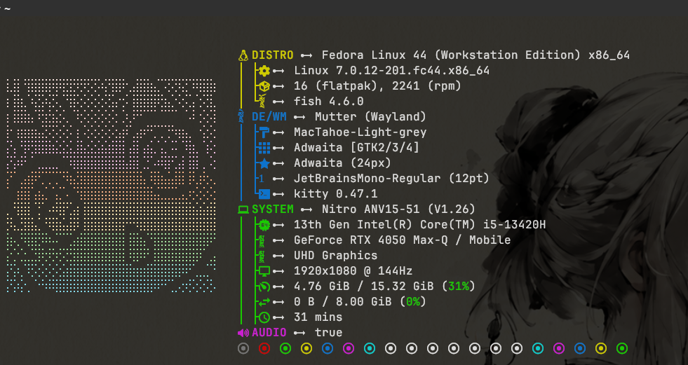

# Fastfetch config 
<p>inspired from many of the config in internet </p>
<p align="center">
  
</p>
## Clone the repo to the ~/.config/fastfetch/
```bash
cd ~/.config/fastfetch
git clone https://github.com/NirajMandal01/fastfetchrepo.git
